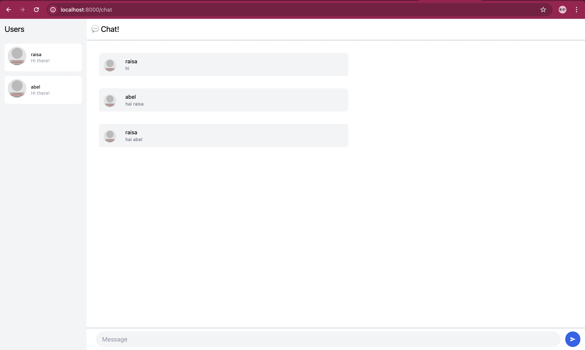

# Tutorial 10

## 3.1. Original Code

## 3.2. Add some creativities to the webclient

I modified the HTML by changing the background color, adjusting border colors, and updating button and input backgrounds.